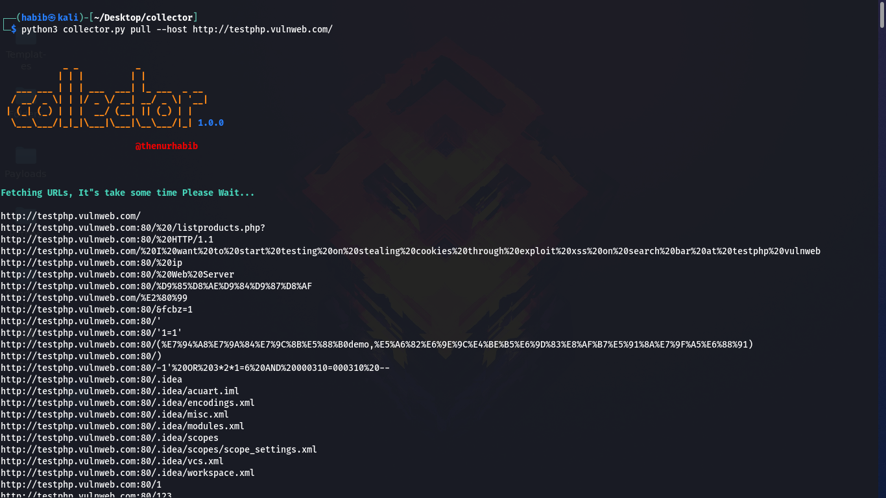
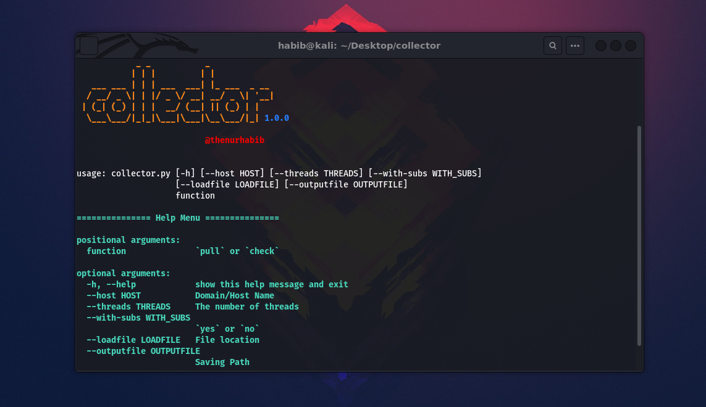

<h1 align="center">
  <br>
  <a href="https://github.com/thenurhabib/collector"></a>
  <br>
  collector
  <br>
</h1>

<h4 align="center">Collect XSS vulnerable parameters from entire domain.</h4>

<p align="center">
  <a href="https://github.com/thenurhabib/collector/releases">
    
  </a>
 
  <a href="https://github.com/thenurhabib/collector/issues?q=is%3Aissue+is%3Aclosed">
      
  </a>
  
  <a href="https://github.com/thenurhabib/collector/blob/main/LICENSE">
      
  </a>
  

</p>



<br>

```bash

            _ _           _             
           | | |         | |            
   ___ ___ | | | ___  ___| |_ ___  _ __ 
  / __/ _ \| | |/ _ \/ __| __/ _ \| '__|
 | (_| (_) | | |  __/ (__| || (_) | |   
  \___\___/|_|_|\___|\___|\__\___/|_| 1.0.0

                          @thenurhabib 

```

<br>


collector is An Intelligent Automated tool used to collect every vulnerable parameters via Wayback Machine.


### Main Features
- Find XSS vulnerable patameters.
- Crwal entire website and collect every URL
- Advance Error Handling.
- Collect GET parameters.


`This Framework Also crawl URLs and JS Files for sensitive information.`

<br>

### Installation

```bash
git clone https://www.github.com/thenurhabib/collector
cd collector
pip install -r requirements.txt
python3 collector.py -h
```
### usage
```bash
python3 collector.py -d pull --host example.com
```


<br>


#### Available command line options

```bash
=============== Help Menu ===============

positional arguments:
  function              `pull` or `check`

options:
  -h, --help                 show this help message and exit
  --host HOST                 Domain/Host Name
  --threads THREADS           The number of threads
  --with-subs WITH_SUBS       `yes` or `no`
  --loadfile LOADFILE         File location
  --outputfile OUTPUTFILE     Saving Path
```





<br>

### :warning: Warning!

***I Am Not Responsible of any Illegal Use***

-------------------------------------

### _🕷️ Contribution & License_

You can contribute in following ways:

- [Report bugs & add issues](https://github.com/thenurhabib/collector/issues/new)
- Search for new vulnerability
- Develop plugins
- Searching Exploits
- Give suggestions **(Ideas)** to make it better

Do you want to have a conversation in private? email me : thenurhabib@gmail.com

***collector*** is licensed under [GPL-3.0 License](https://github.com/thenurhabib/collector/blob/master/LICENSE)
